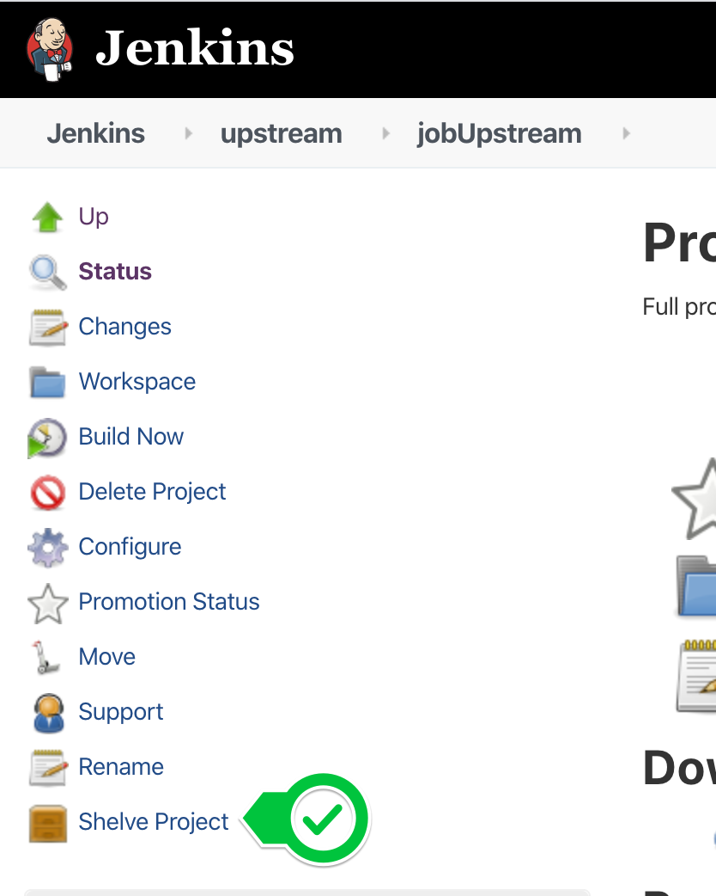
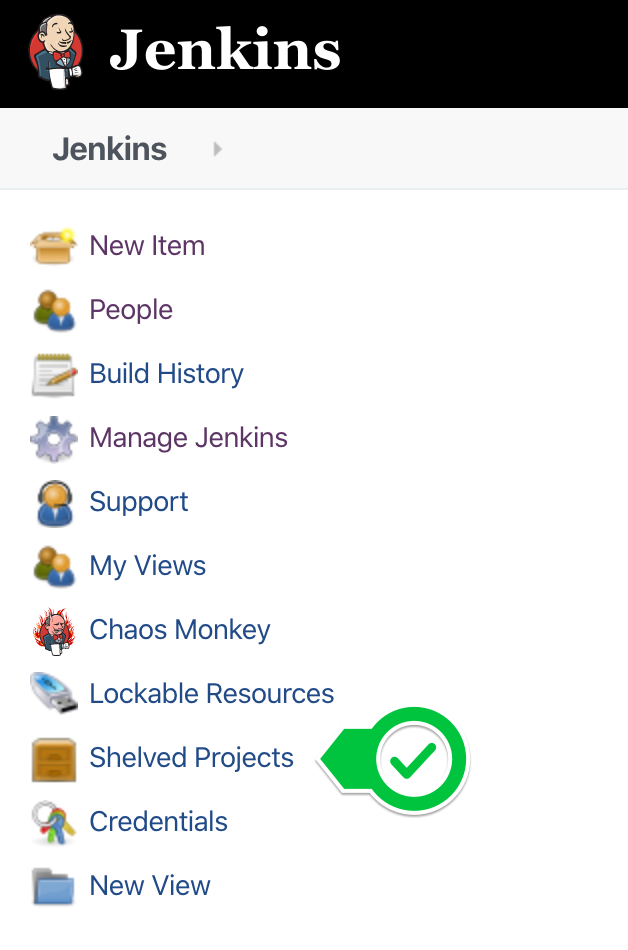
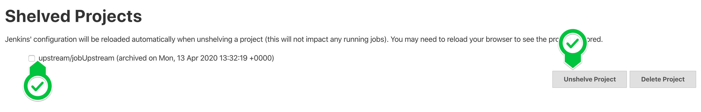

= Shelve Project Plugin

image:https://img.shields.io/jenkins/plugin/v/shelve-project-plugin.svg[link=https://plugins.jenkins.io/shelve-project-plugin]
image:https://img.shields.io/github/release/jenkinsci/shelve-project-plugin-plugin.svg?label=changelog[link=https://github.com/jenkinsci/shelve-project-plugin-plugin/releases/latest]
image:https://img.shields.io/jenkins/plugin/i/shelve-project-plugin.svg?color=blue[https://plugins.jenkins.io/shelve-project-plugin]

This plugin lets you shelve projects so that they can easily be resurrected.
"Shelving a project" is like deleting a project into a recycle bin.
When you shelve a project, it will disappear from the list of projects and become inaccessible from Jenkins, just like how it goes
when a project is deleted, with one difference — instead of getting deleted, the data is archived into a tar file and stored on the server.
This allows the administrator to resurrect it later (aka unshelving), in an unlikely event that the job turned out to be necessary.

This feature is convenient when you have lots of old jobs lying around, and you are 99% sure you won't need them but you can't rule out 1% possibility that you might find them necessary later.

[[ShelveProjectPlugin-Usage]]
== Usage

When you install this plugin, you get "shelve project" in each job page,
as follows: +

You can click this icon and shelve the project.
The shelved projects can be resurrected from the Jenkins top page:

* first click on the *Shelved Project* action:

* Then choose the project you wish to unshelve:

IMPORTANT: In order to unshelve, the user needs the *ADMINISTER* permission.

[[ShelveProjectPlugin-Security]]
== Security

Shelving a project requires the *DELETE* permission.
Unshelving a project requires the *ADMINISTER* permission.

== Changelog
ifdef::env-github,env-browser[:outfilesuffix: .adoc]

From version 2.5 on, changelog is automatically generated using
https://github.com/toolmantim/release-drafter[release-drafter]. See
directly the https://github.com/jenkinsci/shelve-project-plugin/releases[GitHub
release page for the plugin].

For older releases, have a look to the <<CHANGELOG#,archive>>.

[[ShelveProjectPlugin-Knownissueandworkaround]]
== Known issue and workaround

=== Fixed in 2.5

NOTE: This issue has been fixed in release 2.5 of the plugin however all the
shelves created using an earlier version of the plugin will have the
issue and you'll need to apply the workaround.

There is a currently a known issue in Core, making the tar function
breaking the symlinks.
Sadly, the Shelve Pipeline Plugin is using this tar function, and therefore the symlinks are lost during the shelving/unshelving process.

Up until Jenkins 2.90, this was mainly hidden from the end user, as
Jenkins was silently fixing the symlinks during a build.
But since this version, some changes made this issue visible.

This means that, when you unshelve a job, you will see a stack trace like this in all your build logs:

[source,syntaxhighlighter-pre]
----
ln builds/lastSuccessfulBuild ***/jenkins-home/jobs/toto/lastSuccessful failed
java.nio.file.DirectoryNotEmptyException: ***/jenkins-home/jobs/toto/lastSuccessful
    at sun.nio.fs.UnixFileSystemProvider.implDelete(UnixFileSystemProvider.java:242)
    at sun.nio.fs.AbstractFileSystemProvider.deleteIfExists(AbstractFileSystemProvider.java:108)
    at java.nio.file.Files.deleteIfExists(Files.java:1165)
    at hudson.Util.createSymlink(Util.java:1333)
    at hudson.model.Run.createSymlink(Run.java:1866)
    at hudson.model.Run.updateSymlinks(Run.java:1847)
    at hudson.model.Run.execute(Run.java:1725)
    at hudson.model.FreeStyleBuild.run(FreeStyleBuild.java:43)
    at hudson.model.ResourceController.execute(ResourceController.java:97)
    at hudson.model.Executor.run(Executor.java:421)
----

While this won't affect the output of your build, this is far from convenient.
A workaround for this issue is to manually delete the wrongly created files using a script.
Here is an example:

* First make a dry run to ensure the script is not deleting something it
shouldn't:

[source,shell]
----
find ${JENKINS_HOME}/jobs/ -type d \( -name lastFailedBuild -o -name lastSuccessfulBuild -o -name lastUnsuccessfulBuild -o -name lastStableBuild -o -name lastUnstableBuild -o -name lastFailed -o -name lastSuccessful -o -name lastUnsuccessful -o -name lastStable -o -name lastUnstable \)
----

* Then, do the real cleaning:

[source,shell]
----
find ${JENKINS_HOME}/jobs/ -type d \( -name lastFailedBuild -o -name lastSuccessfulBuild -o -name lastUnsuccessfulBuild -o -name lastStableBuild -o -name lastUnstableBuild -o -name lastFailed -o -name lastSuccessful -o -name lastUnsuccessful -o -name lastStable -o -name lastUnstable \) -exec rm -rfv "{}" \;
----

== License

The plugin follows Jenkins licensing (exception listed below).

File manager icon (shelve-project-icon.png) was released into the public domain by the *Tango! Desktop Project*.
The original image can be found https://commons.wikimedia.org/wiki/File:System-file-manager.svg[here].
